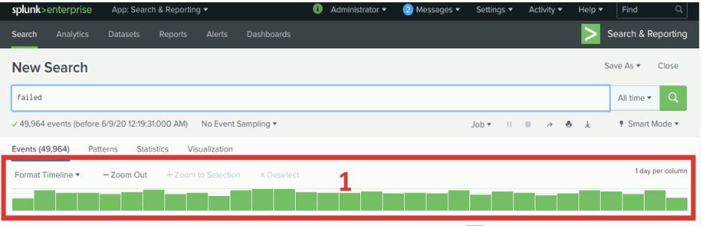

# 🔍 Lab 01: Splunk Basics

## Goal

Get familiar with the Splunk interface and basic search functionality. Learn how to execute term searches, multi-term filtering, quoted phrase searches, and interpret the search results layout.

---

## Scenario

You are a new SOC Analyst at **Buttercup Games**. The company uses Splunk for monitoring web transactions, database activity, and system security logs. Your goal is to navigate Splunk, perform your first queries, and analyze simple results.

---

## Tools

- Splunk Search & Reporting App
- Time Picker
- Search bar
- Events view + Fields sidebar

---

## Splunk Interface Overview

<p align="center">
  
  <br>
  <em>Splunk interface with Search Bar, Time Picker, and Sidebar</em>
</p>

---

## Steps

### 1. Log into Splunk

**Credentials:**
```plaintext
Username: admin
Password: *******
```

---

### 2. Open the "Search & Reporting" App

- Navigate to **Search & Reporting** from the left panel.
- This is where all search queries will be executed.

<p align="center">
  
  <br>
  <em>Opening the Search & Reporting App</em>
</p>

---

### 3. Interface Tour

Key components of the Splunk search interface:
- 🔍 **Search bar** (center)
- 🕒 **Time picker** (top-right)
- 📁 **Fields** (left panel)
- 📃 **Event list** (center results)

<p align="center">
  
  <br>
  <em>Search bar and Time Picker UI</em>
</p>

---

### 4. Run a Basic Search

Search for all events with the word `failed`.

```spl
failed
```

Make sure Time Picker is set to **All time**.

<p align="center">
  
  <br>
  <em>Executing a basic search for "failed"</em>
</p>

---

### 5. Analyze Search Results

Observe:
- Event timeline (top bar)
- Highlighted fields: `host`, `source`, `sourcetype`
- Event field breakdown

<p align="center">
  
  <br>
  <em>Event activity timeline above result panel</em>
</p>

<p align="center">
  
  <br>
  <em>Fields extracted from search events</em>
</p>

---

## Knowledge Check

**Q1:** What is the date of the most recent event?  
📅 **A:** 5/27/20

**Q2:** What is the username of the most recent failed login?  
👤 **A:** ubuntu

**Q3:** What is the source of the most recent event?  
📄 **A:** `/var/log/splunk/default/linux_s_30DAY.log`

---

### 6. Run a Multi-Term Search

Search using two keywords:

```spl
failed root
```

<p align="center">
  
  <br>
  <em>Search for "failed root" returning more specific results</em>
</p>

---

### 7. Run a Quoted Phrase Search

```spl
"failed password for root"
```

<p align="center">
  
  <br>
  <em>Exact phrase search with high match count</em>
</p>

---

## 📓 Summary

| Topic               | Covered |
|--------------------|---------|
| Search bar basics  | ✅       |
| Time picker usage  | ✅       |
| Term search        | ✅       |
| Multi-term search  | ✅       |
| Quoted phrase search | ✅     |
| Event fields (`host`, `source`, `sourcetype`) | ✅ |

---

## Reflection

Basic search capabilities are the foundation of any SOC analyst's Splunk workflow. In this lab, you explored how keyword and phrase matching help filter out key events in large log sets.

---

**Next Lab →** [02 Filters & Queries](02_filters_and_queries.md)
