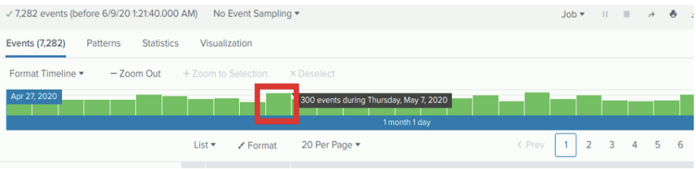
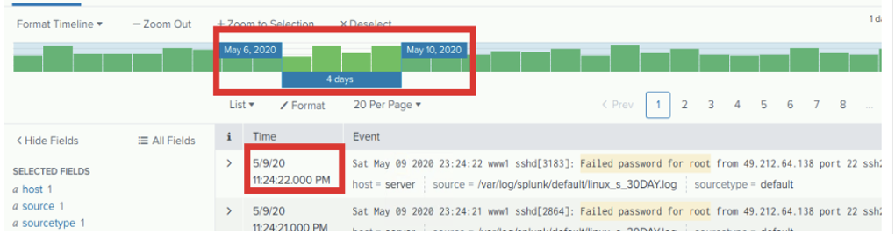
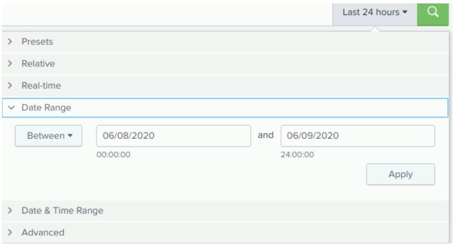
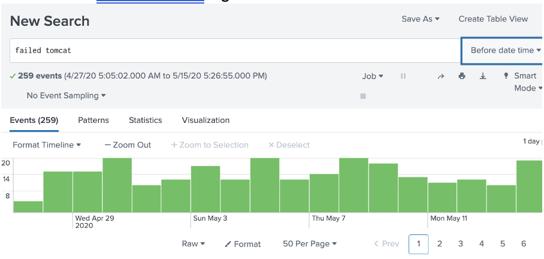
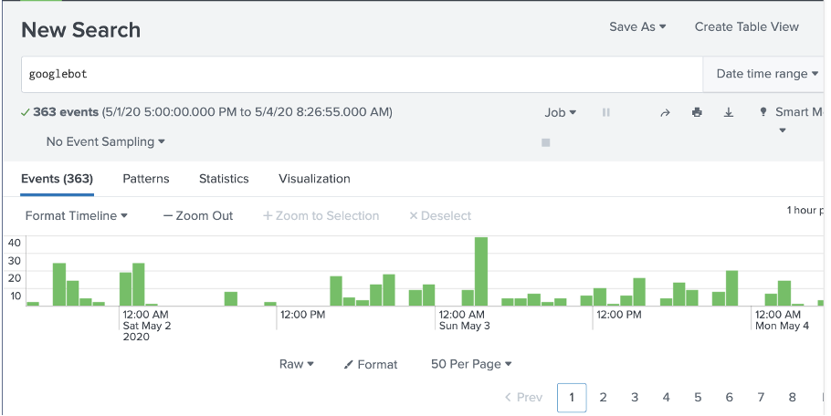
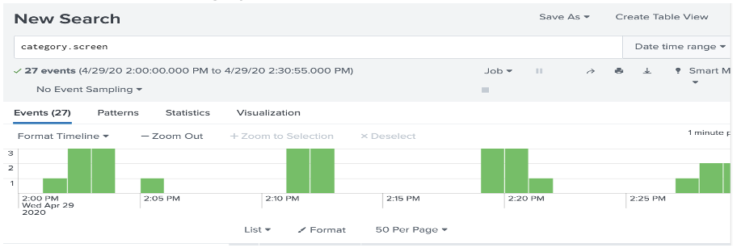
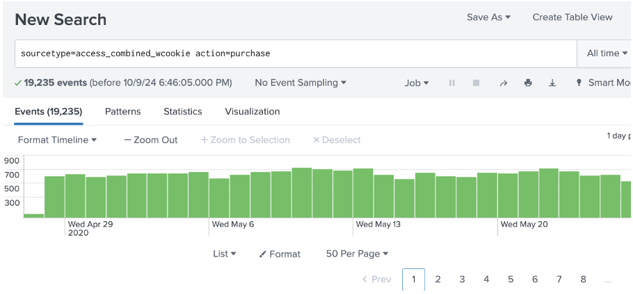
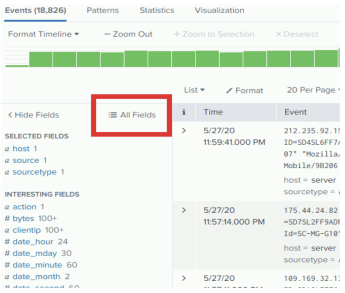
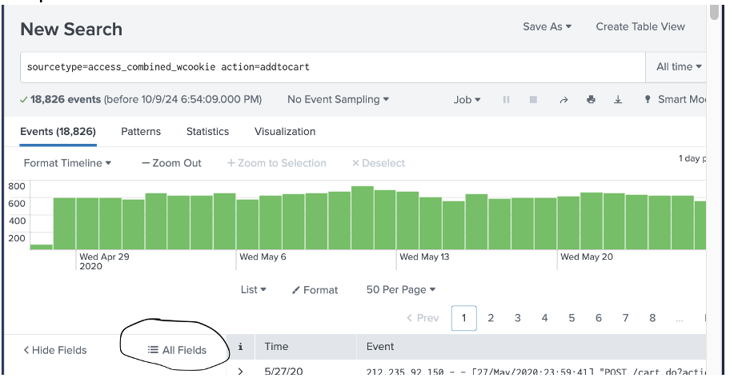
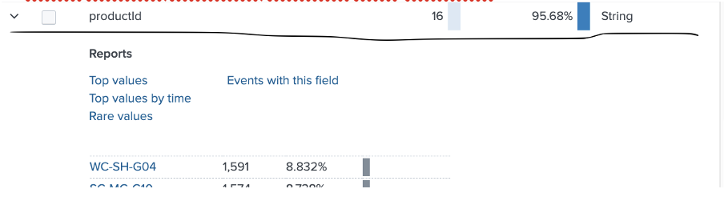

# 🔍 Lab 02: Filters & Queries

## Goal

Understand how to filter events in Splunk using various time selectors and query techniques. Learn how to extract specific data using time filters, field filters, and metadata.

---

## Scenario

You're a SOC Analyst at **Buttercup Games**, using Splunk to monitor security events, web traffic, and application logs. This lab focuses on refining your ability to query and filter results effectively.

---

## Tools Used

- Splunk Time Picker
- Search Bar
- Event Timeline
- Field Sidebar

---

## Tasks & Concepts

### 1. Filtering by Time Range

  
   
  <em>Setting Splunk to All Time for full event range</em>

  
   
  <em>Searching for 'failed password for root'</em>

---

### 2. Filtering by Date Range

- `"failed tomcat"` → before May 15, 2020  
- `"sshd session opened"` → May 17–23, 2020

  
   
  <em>Filtering failed tomcat logins before May 15</em>

  
   
  <em>Filtering SSHD sessions from May 17 to 23</em>

---

### 3. Filtering by Date & Time Range

- `"Googlebot"` → between `May 1, 17:00` and `May 4, 08:00`  
- `"category.screen"` between `April 29, 14:00` to `14:30`

  
   
  <em>Result of Googlebot query in specific date-time range</em>

  
   
  <em>Finding 'category.screen' activity on April 29</em>

---

### 4. Using Fields for Queries

- `sourcetype=access_combined_wcookie`  
- Refine by:
  - `action=purchase`
  - `referer_domain="http://www.google.com"`  
  - Time filter for May 18+

  
   
  <em>Searching all access_combined_wcookie events</em>

  
   
  <em>Filtering by action=purchase</em>

  
   
  <em>Filtering purchases with Google referrer</em>

---

### 5. Exploring All Fields Panel

  
   
  <em>Exploring All Fields in Splunk results</em>

---

## Summary

| Task                       | Covered |
|----------------------------|---------|
| Time filtering             | ✅      |
| Date range & exact time    | ✅      |
| Field-level queries        | ✅      |
| Search by metadata         | ✅      |
| All Fields panel usage     | ✅      |

---

## Reflection

Time and metadata filtering in Splunk lets analysts pinpoint relevant events in a sea of log noise. These techniques are the backbone of precise event analysis in any SOC.

---

**Next Lab →** [03 Fields & Transforms](../03_Fields_and_Transforms/README.md)
