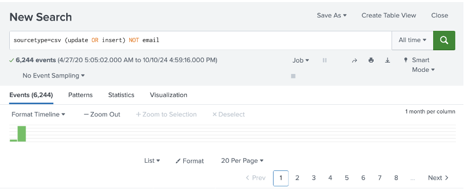
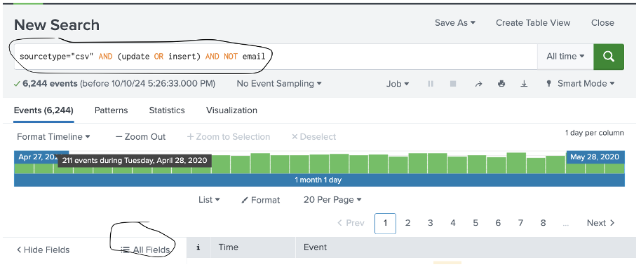
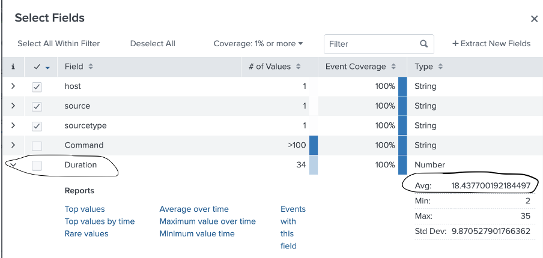
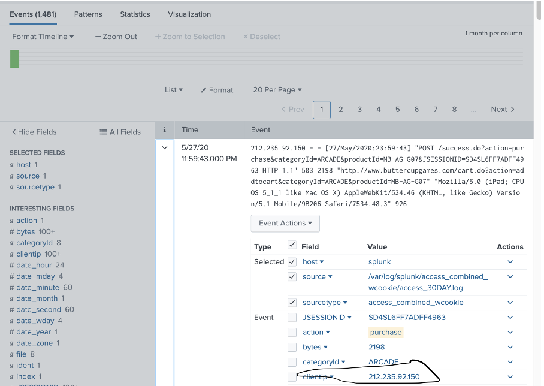
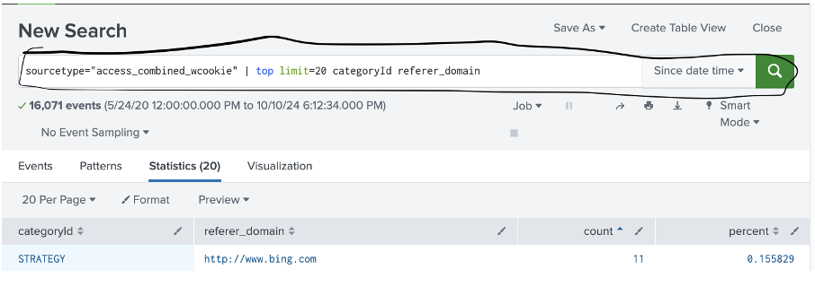
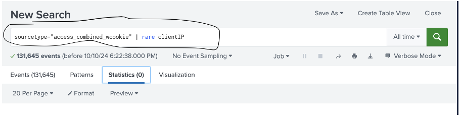

# Lab 03: Fields & Transforms

## Goal

Explore how to refine Splunk search results using field-based filtering, Boolean logic, and field transformation commands like `lookup`, `rename`, `eval`, `dedup`.

---

## Scenario

You're a SOC Analyst at **Buttercup Games**, and your task is to fine-tune search results in Splunk by manipulating field data and understanding event structure.

---

## Tools Used

- Splunk Search Bar
- Field Sidebar
- Transformation Commands: `table`, `sort`, `dedup`, `eval`

---

## Tasks & Techniques

### 1. Boolean Search

Search for events that **contain 'update' OR 'insert'** but **exclude 'email'**.

```spl
update OR insert NOT email
```

<p align="center">
  
  <br><em>Search results using boolean operators</em>
</p>

---

### 2. Filter by Sourcetype

Restrict events to those from a CSV source:

```spl
sourcetype=csv
```

<p align="center">
  
  <br><em>Filtered events with sourcetype=csv</em>
</p>

---

### 3. View & Use Fields

Use the Fields Sidebar to explore available fields.

<p align="center">
  
  <br><em>CSV field structure visualized</em>
</p>

---

### 4. Rename & Lookup Fields

Combine `rename` with `lookup` for better field labeling and data enrichment.

```spl
... | rename product_id AS pid | lookup products.csv pid OUTPUT product_name
```

<p align="center">
  
  <br><em>Renaming and lookup transformation</em>
</p>

---

### 5. Table, Sort, Dedup

Display selected fields, sort results, and remove duplicates.

```spl
... | table product_name, price | sort price | dedup product_name
```

<p align="center">
  
  <br><em>Applying table, sort, and dedup</em>
</p>

---

### 6. Eval for Custom Fields

Use `eval` to create new fields from existing data.

```spl
... | eval discount_price = price * 0.9
```

<p align="center">
  
  <br><em>Creating a calculated field using eval</em>
</p>

---

## Summary

| Command         | Function                        |
|----------------|----------------------------------|
| `OR`, `NOT`     | Boolean filtering                |
| `sourcetype`    | Source type filter               |
| `rename`, `lookup` | Field manipulation             |
| `table`, `sort`, `dedup` | Organize results        |
| `eval`          | Field transformation             |

---

## Reflection

This lab enhances your ability to manipulate data inside Splunk queries. It’s a key skill for cleaning, enriching, and presenting data meaningfully in investigations.

---

**Next Lab →** [04 Visualizations](../04_Visualizations/README.md)
