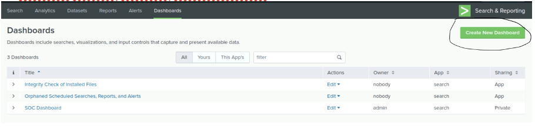
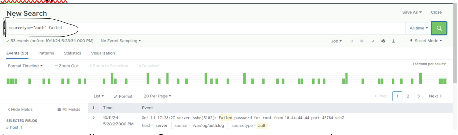
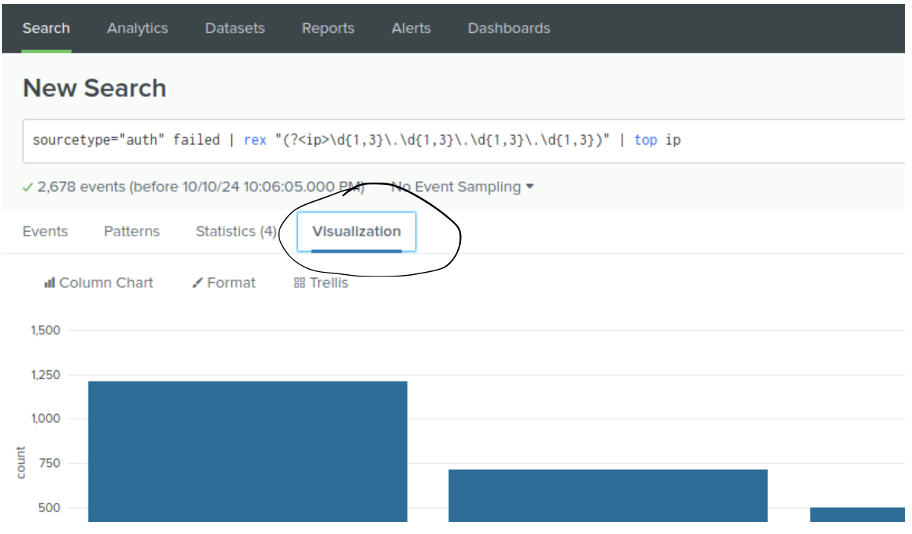
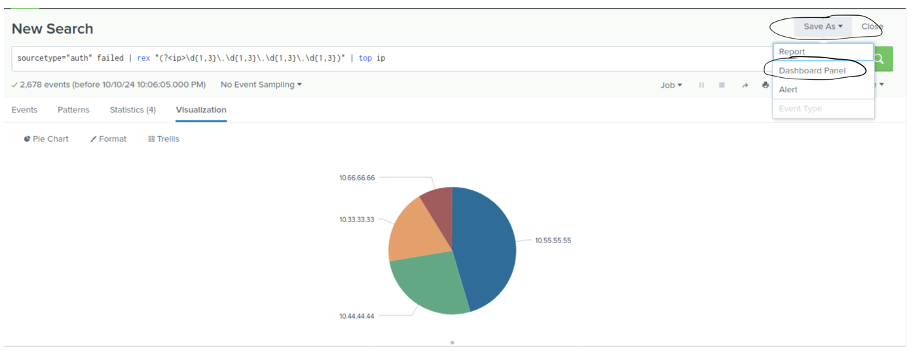
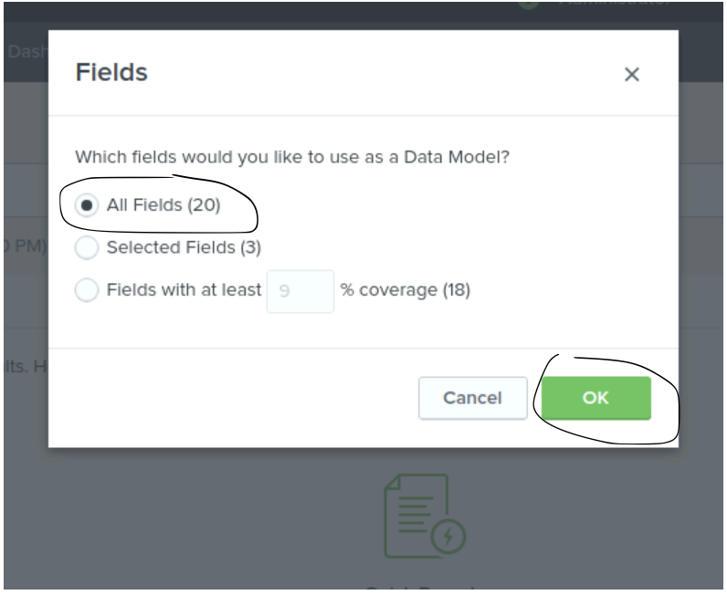
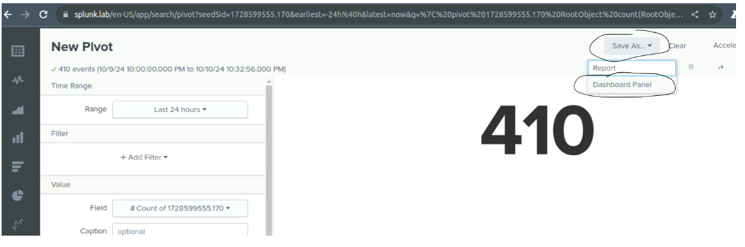
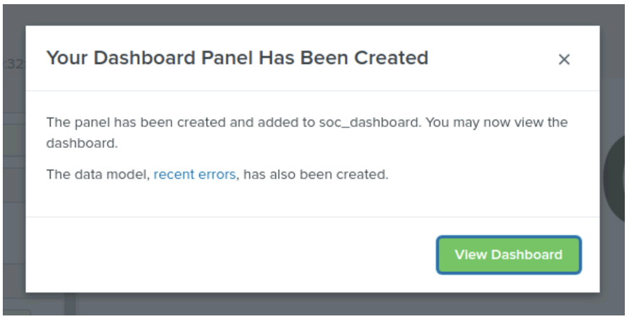
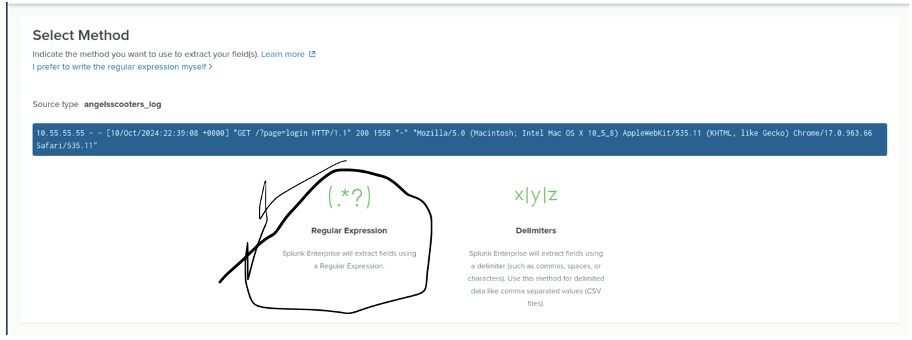
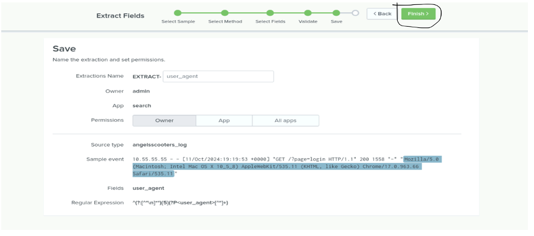
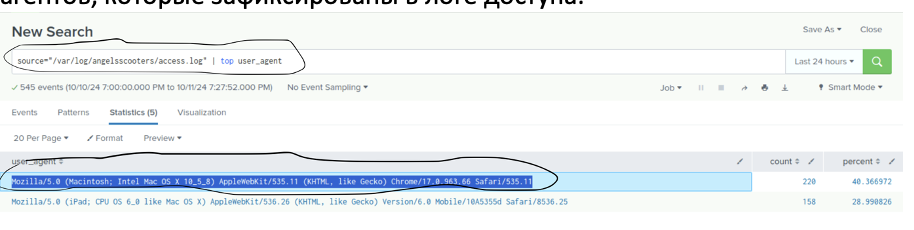

# Lab 04: Visualizations

## Goal

Learn how to build visual dashboards in Splunk using different types of charts and field-based transformations to make data insights visually accessible.

---

## Scenario

You're tasked with building dashboards for the SOC team at **Buttercup Games**. Visual insights will be used by executives and threat hunters alike to monitor trends and detect anomalies.

---

## Tools Used

- Pie Chart
- Single Value Panel
- Column Chart
- Pivot Table
- Commands: `rex`, `top`, `eval`

---

## Tasks & Visualizations

### 1. Pie Chart: Top Product Counts

```spl
sourcetype=access_combined_wcookie | top product_name
```

<p align="center">
  
  <br><em>Pie chart settings for visualizing top products</em>
</p>

<p align="center">
  
  <br><em>Pie chart output displaying product distribution</em>
</p>

---

### 2. Single Value Panel

```spl
sourcetype=access_combined_wcookie | stats count AS TotalEvents
```

<p align="center">
  
  <br><em>Single value visualization of total events</em>
</p>

---

### 3. Column Chart: Product Purchases

```spl
sourcetype=access_combined_wcookie action=purchase | top product_name
```

<p align="center">
  
  <br><em>Bar chart showing top purchased products</em>
</p>

---

### 4. Extract Fields with REX

```spl
... | rex "product_id=(?<pid>[^&]+)"
```

<p align="center">
  
  <br><em>Using REX to extract product ID from URLs</em>
</p>

---

### 5. Top Product Analysis

```spl
... | top product_name
```

<p align="center">
  
  <br><em>Top command to find most frequent product names</em>
</p>

---

### 6. Pivot Report

<p align="center">
  
  <br><em>Setting up Pivot for visualization</em>
</p>

<p align="center">
  
  <br><em>Pivot chart showing product frequency</em>
</p>

---

### 7. Dashboard View

<p align="center">
  
  <br><em>Time range filtering inside the dashboard</em>
</p>

<p align="center">
  
  <br><em>Completed dashboard with multiple visualizations</em>
</p>

---

## 📓 Summary

| Visualization Type | Tool Used        |
|--------------------|------------------|
| Product Share      | Pie Chart        |
| Total Event Count  | Single Value     |
| Top Purchases      | Column Chart     |
| Field Parsing      | REX Command      |
| Field Aggregation  | Pivot & Top      |

---

## Reflection

Visualizations empower analysts to **interpret data faster** and communicate findings effectively. Building dashboards is a crucial part of delivering security insights.

---

**Next Lab →** [05 Alerts](../05_Alerts/README.md)
